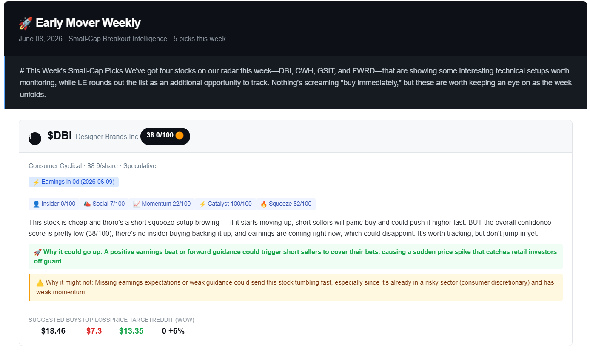

# 🚀 Early Mover — Small-Cap Breakout Intelligence Pipeline


An autonomous, end-to-end stock intelligence pipeline that identifies small-cap stocks ($5–$20) with converging breakout signals **before they move**. Every Monday at 7 AM ET, GitHub Actions runs the full pipeline and delivers a scored digest — no manual intervention required.

> Built to solve a real problem: most retail investors see breakout candidates *after* the move. Early Mover aggregates insider activity, social momentum, catalyst timing, and short squeeze setups into a single confidence score, synthesized by Claude Haiku into plain-English rationale.

---

## 📬 Sample Output



*Weekly email digest — scored picks with AI rationale, upside/downside cases, and suggested entry levels*

---

## ⚙️ How It Works

Every Monday at 7 AM ET, GitHub Actions triggers the full pipeline automatically:

```
[Finviz Screener] → [Multi-Source Scrapers] → [Scoring Engine] → [Claude Haiku] → [Email Digest]
                                                      ↓
                                              [SQLite DB] → [Streamlit Dashboard]
```

### Signal Sources

| Source | Signal | Weight |
|--------|--------|--------|
| SEC EDGAR Form 4 | Insider buying activity (14d) | 25% |
| Reddit (PRAW) | Mention velocity week-over-week | 20% |
| Unusual Options | Unusual call/put flow | 20% |
| Catalyst Calendar | Upcoming earnings/FDA events (30d) | 20% |
| yfinance | Short interest / float | 15% |

---

## 🛠️ Tech Stack

- **Orchestration:** GitHub Actions (cron, fully autonomous)
- **Data:** Finviz, SEC EDGAR, Reddit PRAW, yfinance, NewsAPI
- **Scoring:** Custom weighted signal engine
- **AI:** Claude Haiku (Anthropic) — pick rationale + bull/bear cases
- **Storage:** SQLite for P&L tracking and historical picks
- **Delivery:** Gmail SMTP with HTML email templates
- **Dashboard:** Streamlit

---

## 📈 Status

- ✅ Pipeline has been running autonomously for **3 weeks**
- ✅ Delivering **5 picks/week** with scored confidence and AI rationale
- ✅ Zero manual intervention since deployment

---

## 🚀 Setup

### 1. Clone & Install
```bash
git clone https://github.com/Obi-DataEng/early-mover-stock-intelligence.git
cd early-mover-stock-intelligence
pip install -r requirements.txt
```

### 2. Configure Environment Variables
```bash
cp .env.example .env
```

| Variable | Description |
|----------|-------------|
| `ANTHROPIC_API_KEY` | Claude Haiku for AI synthesis |
| `REDDIT_CLIENT_ID / SECRET` | Reddit PRAW app credentials |
| `NEWS_API_KEY` | NewsAPI.org (free tier) |
| `GMAIL_USER / APP_PASSWORD` | Gmail SMTP delivery |
| `EMAIL_RECIPIENTS` | Comma-separated recipient list |

### 3. Run Manually
```bash
python main.py --init-db   # First time only
python main.py --run       # Test the full pipeline
```

### 4. Deploy to GitHub Actions
Push to GitHub and add all `.env` values as **GitHub Secrets** (Settings → Secrets → Actions). The workflow in `.github/workflows/weekly_run.yml` fires automatically every Monday at 7 AM ET.

---

## 📁 Project Structure

```
early-mover/
├── main.py              # Pipeline orchestrator
├── config.py            # Settings & constants
├── scrapers/            # Data ingestion (SEC, Reddit, Finviz, News)
├── scoring/             # Weighted signal engine
├── ai/                  # Claude Haiku synthesis
├── delivery/            # Email builder & HTML templates
├── dashboard/           # Streamlit dashboard
├── data/                # SQLite DB + processed outputs
└── .github/workflows/   # GitHub Actions cron job
```

---

## 🗺️ Roadmap

| Phase | Timeline | Upgrade |
|-------|----------|---------|
| ✅ Phase 1 | Live | All free sources, full autonomous pipeline |
| 🔜 Phase 2 | Weeks 4–6 | Quiver Quantitative ($15/mo) for institutional flow |
| 🔜 Phase 3 | TBD | Benzinga Pro real-time news ($40/mo) |
| 🔜 Phase 4 | Long term | Backtrader backtesting + Quantstats P&L tearsheet |

---

## ⚠️ Disclaimer

This tool is for educational and personal research only. Not financial advice. Small-cap stocks carry significant risk — never invest more than you can afford to lose.
